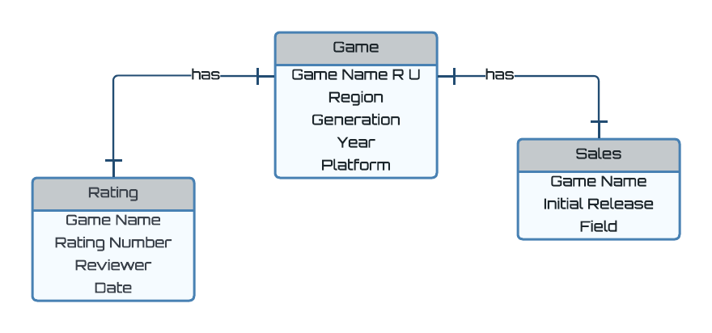

# Database-Project-Spring-2024

## Each Pokemon Game has its own rating from many different sources, as well as recorded sales numbers. This project will test if these different sales and ratings have any relation to each other.

### Entities:
1. Pokemon Games - Strong
2. IGN Ratings - Weak
3. Sales - Weak

### Relationships
1. Many or One Game has One IGN Rating
2. Many or One Game has One Sales

### Game Attributes
1. Name R U
2. Region
3. Generation
4. Year
5. Platform

### Rating Attributes
1. Review
2. Reviewer
3. Date

### Sales Attributes
1. Initial Release
2. All-time

### Attribute Types
1. Rating - Integer from 0 to 10
2. Sales Numbers - Positive Integer

## ER Diagram

### Data Sources
1. Ratings - https://www.ign.com/articles/2019/06/05/every-ign-pokemon-game-review (not using all data, but most)
2. Sales Data - https://vgsales.fandom.com/wiki/Pokémon#:~:text=Pokémon%20is%20the%20highest-grossing,billion%20from%20licensed%20merchandise%20sales
